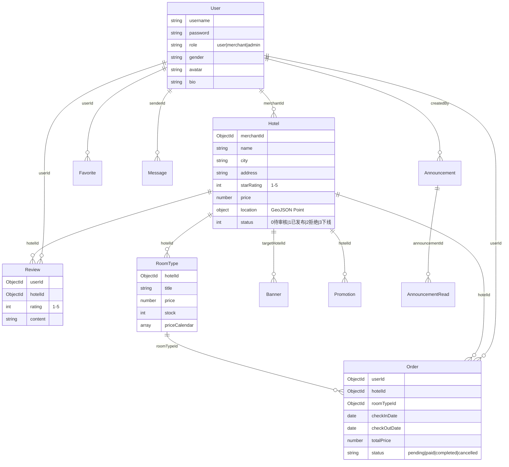

<div align="center">

# 🏨 易宿酒店预订平台

**Yisu Hotel Platform**

面向现代旅游出行场景的全栈酒店预订与管理系统

[](https://sonarcloud.io)
[](https://sonarcloud.io)
[](https://expressjs.com/)
[](https://react.dev/)
[](https://taro.zone/)
[](https://docs.docker.com/compose/)

</div>

---

## 📖 项目简介

易宿酒店预订平台是一个完整的 B2C 酒店预订服务系统，包含三大子系统：

| 子系统 | 技术方案 | 说明 |
|--------|----------|------|
| **用户端 (client)** | Taro + React + TypeScript | 移动端 H5 / 微信小程序，面向终端用户的酒店预订流程 |
| **管理端 (admin)** | React 19 + Vite + Ant Design 6 | PC 端管理后台，商户管理酒店信息 & 管理员审核发布 |
| **服务端 (server)** | Express 5 + MongoDB + Redis | RESTful API + WebSocket 实时通信 |

---

## ✨ 功能特性

### 📱 用户端（移动端）

- **酒店首页** — Banner 轮播广告、城市定位、关键字搜索、日期选择、星级/价格筛选、快捷标签
- **酒店列表** — 条件筛选、上滑自动加载（无限滚动）、酒店卡片展示（名称/评分/地址/价格）
- **酒店详情** — 图片轮播 Banner、基础信息展示、日历选房、房型价格列表（由低到高排序）

### 💼 商户端（PC 管理后台）

- **数据统计** — 收入趋势图、评分分布、日历热力图、环比指标、可点击导航卡片
- **酒店管理** — 酒店信息录入/编辑/保存，实时同步更新
- **房型管理** — 房型增删改、价格日历、库存管控
- **订单管理** — 订单列表查看、日期范围筛选
- **评价管理** — 查看/回复用户评价、评分统计分析
- **促销管理** — 折扣/满减/特价多种促销模式

### 👨‍💼 管理员端（PC 管理后台）

- **酒店审核** — 审核/发布/下线酒店，支持拒绝原因说明，下线可恢复
- **用户管理** — 查看和管理平台用户
- **Banner 管理** — 首页广告素材管理
- **公告管理** — 平台公告发布与管理

### 🔧 通用功能

- **用户登录/注册** — 支持商户/管理员角色注册，登录自动识别角色
- **即时通讯** — 基于 Socket.IO 的实时消息聊天
- **个人中心** — 用户资料编辑、头像上传

### 🛡️ 技术亮点

- **JWT 身份认证** + 角色权限控制（user / merchant / admin）
- **Redis 缓存** 加速热点数据查询
- **Socket.IO** 实时双向通信
- **图片处理** — Sharp 自动压缩优化上传图片
- **API 文档** — Swagger UI 自动化接口文档 (`/api-docs`)
- **安全加固** — Helmet 安全头、express-rate-limit 限流、bcrypt 密码加密
- **结构化日志** — Winston + 按日轮转日志文件
- **Docker 一键部署** — docker-compose 编排 App + MongoDB + Redis

---

## 🏗️ 项目结构

```
yisu-hotel-platform/
├── client/                    # 📱 用户端（Taro 跨端）
│   ├── src/
│   │   ├── pages/             # 页面组件
│   │   │   ├── index/         #   首页（搜索 + Banner）
│   │   │   ├── hotel-list/    #   酒店列表（筛选 + 无限滚动）
│   │   │   └── hotel-detail/  #   酒店详情（轮播 + 房型）
│   │   ├── components/        # 通用组件
│   │   └── services/          # API 服务层
│   └── config/                # Taro 构建配置
│
├── admin/                     # 💻 管理端（React + Vite）
│   ├── src/
│   │   ├── pages/
│   │   │   ├── Login/         #   登录页
│   │   │   ├── Register/      #   注册页
│   │   │   ├── merchant/      #   商户功能 (9个模块)
│   │   │   │   ├── Dashboard/       # 数据统计仪表盘
│   │   │   │   ├── HotelList/       # 酒店管理列表
│   │   │   │   ├── HotelEdit/       # 酒店编辑
│   │   │   │   ├── HotelDetail/     # 酒店详情
│   │   │   │   ├── RoomList/        # 房型管理
│   │   │   │   ├── OrderList/       # 订单列表
│   │   │   │   ├── OrderDetail/     # 订单详情
│   │   │   │   ├── ReviewList/      # 评价管理
│   │   │   │   └── PromotionList/   # 促销管理
│   │   │   ├── admin/         #   管理员功能 (4个模块)
│   │   │   │   ├── HotelList/       # 审核酒店
│   │   │   │   ├── UserList/        # 用户管理
│   │   │   │   ├── BannerList/      # Banner 管理
│   │   │   │   └── AnnouncementList/# 公告管理
│   │   │   └── common/        #   通用页面
│   │   │       ├── Chat/            # 即时通讯
│   │   │       └── Profile/         # 个人中心
│   │   ├── api/               # API 请求封装
│   │   ├── stores/            # Zustand 状态管理
│   │   ├── layouts/           # 布局组件
│   │   ├── hooks/             # 自定义 Hooks
│   │   └── router/            # 路由配置
│   └── vite.config.ts
│
├── server/                    # ⚙️ 服务端（Node.js + Express）
│   ├── app.js                 # 应用入口
│   ├── config/                # 数据库 & Redis 配置
│   ├── middleware/             # 中间件（鉴权/校验/上传/错误处理）
│   ├── models/                # Mongoose 数据模型 (11个)
│   │   ├── User.js            #   用户
│   │   ├── Hotel.js           #   酒店（含地理坐标）
│   │   ├── RoomType.js        #   房型（含价格日历）
│   │   ├── Order.js           #   订单
│   │   ├── Review.js          #   评价
│   │   ├── Favorite.js        #   收藏
│   │   ├── Banner.js          #   广告位
│   │   ├── Promotion.js       #   促销活动
│   │   ├── Announcement.js    #   系统公告
│   │   ├── AnnouncementRead.js#   公告已读记录
│   │   └── Message.js         #   即时消息
│   ├── routes/                # API 路由 (14个模块)
│   ├── utils/                 # 工具函数
│   ├── tests/                 # Jest 单元测试
│   ├── swagger.json           # OpenAPI 3.0 接口文档
│   └── Dockerfile             # Docker 镜像构建
│
├── docs/                      # 📄 项目文档
├── .github/workflows/         # 🔄 CI/CD (GitHub Actions)
│   ├── test_backend.yml       #   后端自动化测试
│   ├── test_frontend.yml      #   前端自动化测试
│   ├── sonar_backend_server.yml  # SonarCloud 后端扫描
│   └── sonar_frontend_admin.yml  # SonarCloud 前端扫描
│
└── docker-compose.yml         # 🐳 一键部署编排
```

---

## 🛠️ 技术栈

### 前端

| 技术 | 版本 | 用途 |
|------|------|------|
| React | 19 / 18 | 视图层框架 |
| TypeScript | 5.x | 类型安全 |
| Taro | 4.1 | 跨端开发（H5 / 微信小程序） |
| Vite | 7.x | 构建工具（管理端） |
| Ant Design | 6.x | UI 组件库（管理端） |
| @ant-design/charts | 2.x | 数据可视化图表 |
| Zustand | 5.x | 轻量状态管理 |
| React Router | 7.x | 路由管理 |
| Socket.IO Client | 4.x | WebSocket 客户端 |
| Sass | 1.x | CSS 预处理器（用户端） |

### 后端

| 技术 | 版本 | 用途 |
|------|------|------|
| Node.js | 18+ | 运行时 |
| Express | 5.x | Web 框架 |
| MongoDB / Mongoose | 6 / 9 | 数据库 & ODM |
| Redis | 7 | 缓存 & 会话 |
| Socket.IO | 4.x | 实时通信 |
| JWT | - | 身份认证 |
| Sharp | 0.34 | 图片压缩处理 |
| Swagger UI | 5.x | API 文档 |
| Winston | 3.x | 日志管理 |
| Helmet | 8.x | HTTP 安全头 |

### DevOps & 质量保障

| 工具 | 用途 |
|------|------|
| Docker + Compose | 容器化部署 |
| GitHub Actions | CI/CD 流水线 |
| SonarCloud | 静态代码分析 |
| Jest + Supertest | 后端单元/集成测试 |
| Vitest + Testing Library | 前端组件测试 |
| ESLint + Prettier | 代码风格统一 |
| Husky + CommitLint | Git 提交规范 |

---

## 🚀 快速开始

### 环境要求

- **Node.js** >= 18
- **MongoDB** >= 6.0
- **Redis** >= 7.0
- **npm** >= 9

### 方式一：本地开发

#### 1. 克隆项目

```bash
git clone https://github.com/your-repo/yisu-hotel-platform.git
cd yisu-hotel-platform
```

#### 2. 启动服务端

```bash
cd server
cp .env.example .env       # 复制并编辑环境变量
npm install
npm run dev                # 启动开发服务器 (默认 http://localhost:5000)
```

#### 3. 启动管理端（PC 后台）

```bash
cd admin
npm install
npm run dev                # 启动 Vite 开发服务器 (默认 http://localhost:5173)
```

#### 4. 启动用户端（移动端）

```bash
cd client
npm install
npm run dev:h5             # H5 模式
# 或
npm run dev:weapp          # 微信小程序模式
```

### 方式二：Docker 一键部署

```bash
# 1. 配置环境变量
cd server
cp .env.example .env
# 编辑 .env，至少设置 JWT_SECRET

# 2. 启动所有服务
cd ..
docker-compose up -d

# 服务启动后：
# - 后端 API:    http://localhost:5000
# - API 文档:    http://localhost:5000/api-docs
# - 健康检查:    http://localhost:5000/api/health
```

---

## ⚙️ 环境变量

服务端核心环境变量说明 (参见 `server/.env.example`)：

| 变量名 | 默认值 | 说明 |
|--------|--------|------|
| `PORT` | 5000 | 服务端口 |
| `NODE_ENV` | production | 运行环境 |
| `MONGODB_URI` | - | MongoDB 连接字符串 |
| `REDIS_URL` | - | Redis 连接地址 |
| `JWT_SECRET` | ⚠️ **必填** | JWT 签名密钥 |

---

## 📡 API 文档

启动服务端后，访问 [http://localhost:5000/api-docs](http://localhost:5000/api-docs) 查看完整的 **Swagger UI** 接口文档。

主要 API 模块：

| 模块 | 路径前缀 | 说明 |
|------|----------|------|
| 认证 | `/api/auth` | 注册、登录 |
| 用户 | `/api/users` | 用户信息管理 |
| 酒店 | `/api/hotels` | 酒店 CRUD + 搜索 |
| 房型 | `/api/rooms` | 房型管理 + 价格日历 |
| 订单 | `/api/orders` | 预订、支付、取消 |
| 评价 | `/api/reviews` | 发表/回复评价 |
| 收藏 | `/api/favorites` | 收藏/取消收藏 |
| 促销 | `/api/promotions` | 促销活动管理 |
| Banner | `/api/banners` | 广告位管理 |
| 公告 | `/api/announcements` | 系统公告 |
| 消息 | `/api/messages` | 即时通讯消息 |
| 上传 | `/api/upload` | 文件/图片上传 |
| 商户统计 | `/api/merchant/stats` | 仪表盘数据 |
| 健康检查 | `/api/health` | 系统状态监控 |

---

## 🧪 测试

```bash
# 后端测试
cd server
npm test                   # Jest 单元测试 + 集成测试

# 管理端测试
cd admin
npm test                   # Vitest 组件测试
npm run test:coverage      # 含覆盖率报告
```

---

## 🛡️ 代码质量

本项目严格遵循高质量代码标准，通过 SonarCloud 进行静态代码分析与 CI/CD 集成测试。

### 📊 质量概览 (Quality Gate: Passed)

| 指标 (Metric) | 状态 (Status) | 数值 (Value) | 评级 (Rating) |
| :--- | :---: | :---: | :---: |
| **Quality Gate** | ✅ Passed | - | **A** |
| **Coverage** | ✅ Passed | **84.5%** | **A** |
| **Duplications** | ✅ Passed | **0.0%** | **A** |
| **Security** | ✅ Safe | 0 Issues | **A** |
| **Reliability** | ✅ Stable | 0 Issues | **A** |
| **Maintainability**| ✅ Clean | 0 Issues | **A** |

> 数据来源：SonarCloud Analysis (2026-02-05)

### 编码规范

- **ESLint** — JavaScript/TypeScript 代码规范检查
- **Prettier** — 统一代码格式化
- **Husky + CommitLint** — Git 提交信息规范（Conventional Commits）
- **StyleLint** — CSS/Sass 样式规范

---

## 📐 数据库设计



---