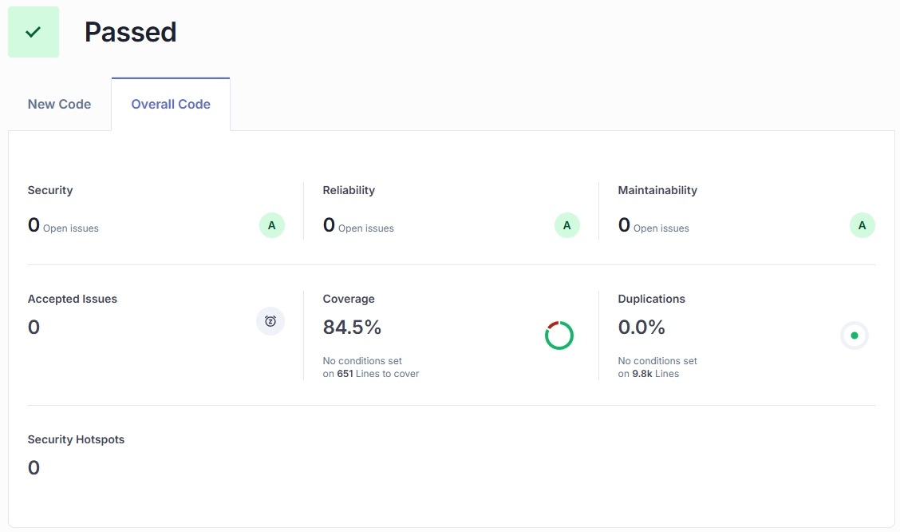

## 🛡️ 代码质量与测试 (Code Quality & Testing)

本项目严格遵循高质量代码标准，通过 SonarCloud 进行静态代码分析与 CI/CD 集成测试。

### 📊 质量概览 (Quality Gate: Passed)

| 指标 (Metric) | 状态 (Status) | 数值 (Value) | 评级 (Rating) |
| :--- | :---: | :---: | :---: |
| **Quality Gate** | ✅ Passed | - | **A** |
| **Coverage** | ✅ Passed | **84.5%** | **A** |
| **Duplications** | ✅ Passed | **0.0%** | **A** |
| **Security** | ✅ Safe | 0 Issues | **A** |
| **Reliability** | ✅ Stable | 0 Issues | **A** |
| **Maintainability**| ✅ Clean | 0 Issues | **A** |

> 数据来源：SonarCloud Analysis (2026-02-05)

